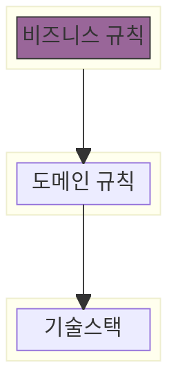

#### 계층형 설계

- 상위는 자주 바뀌는 것
- 하위는 자주 바뀌지 않는 것
  - 의존성이 복잡해 변경이 어렵고 자주 바뀌지 않는다
- 각 계층은 그 아래에 있는 계층을 기반으로 만들어 진다
    - 상위 계층은 의존성이 거의 없기 때문에 쉽게 변경이 가능하다
- 계층형 설계로 만든 아키텍처는 유지보수와 테스트가 용이하다

#### 액션을 타임라인으로 시각화
- 타임라인 다이어그램은 시간에 따라 변하는 액션을 시각화 하는 방법이다
- 분산시스템을 타인라인으로 시각화하면 여러 개의 타임라인이 존재하며, 각각의 타임라인은 다른 순서로 실행된다

#### 시간에 관한 문제 풀기
- 타임라인 커팅
  - 여러 타임라인이 동시에 진행될 때 서로 순서를 맞추는 방법
  - 고차 동작(high-order operation) 으로 구현한다
  